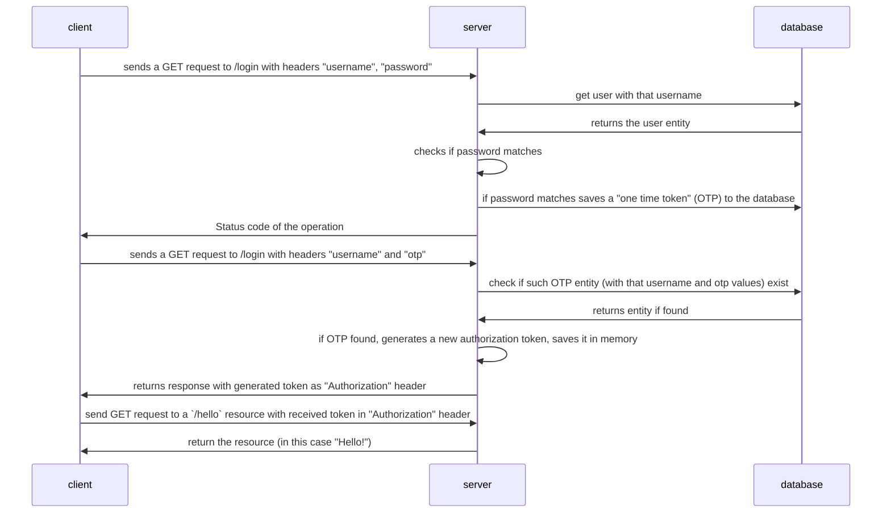

# Spring Security Custom Authentication POC
### Multiple authentication providers

As you can see the step where OTP is saved to the database is somewhat incomplete in a sense that
OTP token is saved to DB but not communicated to the client. It would have to be communicated through
some other channel (e.g. SMS) which is not implemented as part of this POC.
 
To go through the flow the developer would need to manually look up OTP in the database after the first successful
GET request to `/login` with "username" and "password"